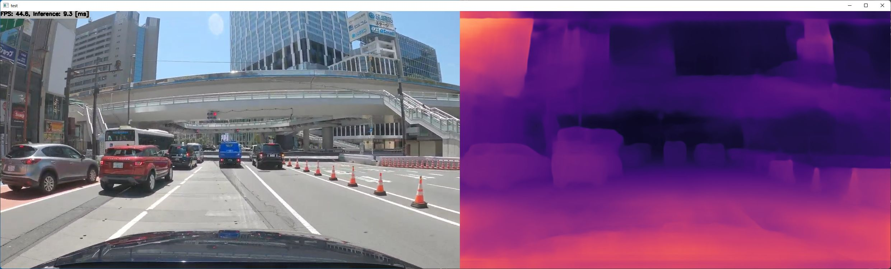

# Depth Estimation (FSRE-Depth) with TensorRT in C++

https://user-images.githubusercontent.com/11009876/167286511-2b111a36-f8bb-4e15-bbb1-b7d8ee25f2f6.mp4

## How to Run
1. Please follow the instruction: https://github.com/iwatake2222/play_with_tensorrt/blob/master/README.md
2. Additional steps:
    - Download the model using the following script
        - https://github.com/PINTO0309/PINTO_model_zoo/blob/main/294_FSRE-Depth/download.sh
        - copy `fsre_depth_384x640/fsre_depth_full_384x640.onnx` to `resource/model/fsre_depth_full_384x640.onnx`
    - Build  `pj_tensorrt_depth_fsre` project (this directory)

- Note: You can also try with ONNX Runtime
    - enable `INFERENCE_HELPER_ENABLE_ONNX_RUNTIME` when execute cmake
    - use `kOnnxRuntime` instead of `kTensorrt` in `depth_engine.cpp`

## Acknowledgements
- https://github.com/hyBlue/FSRE-Depth
- https://github.com/PINTO0309/PINTO_model_zoo
- Test image
    - Drive Video by Dashcam Roadshow
    - 4K東京ドライブ: 明治通りから国道1号 19km（池袋→新宿→渋谷→五反田）
    - https://www.youtube.com/watch?v=tTuUjnISt9s

