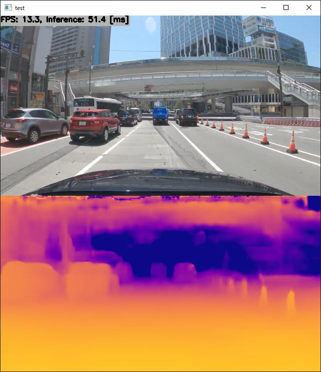

# Depth Estimation using LapDepth with TensorRT in C++
Sample project for LapDepth (Monocular Depth Estimation Using Laplacian Pyramid-Based Depth Residuals)

Click the image to open in YouTube. https://youtu.be/MfJVZM0F0y4

[](https://youtu.be/MfJVZM0F0y4)

## Target Environment, How to Build, How to Run
1. Please follow the instruction: https://github.com/iwatake2222/play_with_tensorrt/blob/master/README.md
2. Additional steps:
    - Convert the model to onnx format. Please refer to the following colab script
        - https://github.com/iwatake2222/play_with_tensorrt/blob/master/pj_tensorrt_depth_lapdepth/00_doc/pytorch_pkl_2_onnx_LapDepth.ipynb
        - Notice: the original model is published under the GPL-3.0 license
    - Build  `pj_tensorrt_depth_lapdepth` project (this directory)

## Acknowledgements
- https://github.com/tjqansthd/LapDepth-release
```
@ARTICLE{9316778,
  author={M. {Song} and S. {Lim} and W. {Kim}},
  journal={IEEE Transactions on Circuits and Systems for Video Technology}, 
  title={Monocular Depth Estimation Using Laplacian Pyramid-Based Depth Residuals}, 
  year={2021},
  volume={},
  number={},
  pages={1-1},
  doi={10.1109/TCSVT.2021.3049869}}
```
