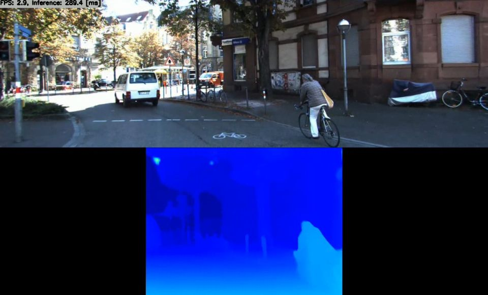

# Stereo Matching using CoEx with TensorRT in C++
Sample project to run Stereo Matching using CoEx

Click the image to open in YouTube. https://youtu.be/fCIdXr0Hpbk

* Test image data is "2011_09_26_drive_0005" from The KITTI Dataset

## Target Environment, How to Build, How to Run
1. Please follow the instruction: https://github.com/iwatake2222/play_with_tensorrt/blob/master/README.md
2. Additional steps:
    - Download the model using the following script
        - https://github.com/PINTO0309/PINTO_model_zoo/blob/main/135_CoEx/download.sh
        - copy `saved_model/coex_480x640.onnx` to `resource/model/coex_480x640.onnx`
    - Build  `pj_tensorrt_depth_stereo_coex` project (this directory)

## Acknowledgements
- https://github.com/antabangun/coex
- https://github.com/PINTO0309/PINTO_model_zoo
- http://www.cvlibs.net/datasets/kitti/raw_data.php
