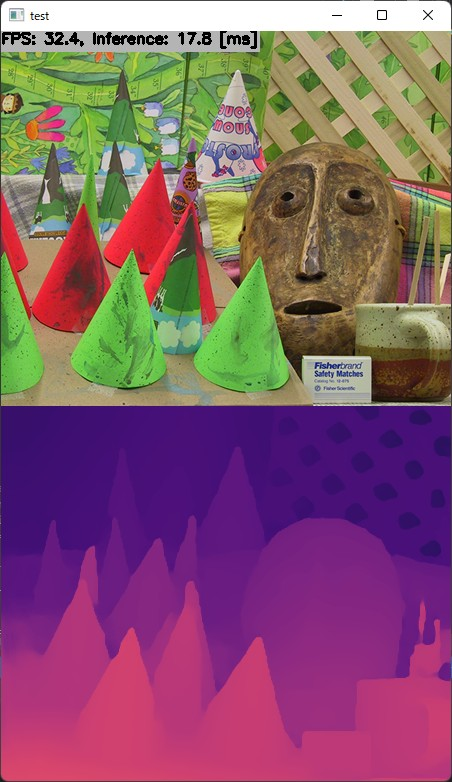

# Stereo Depth Estimation using HITNET with TensorRT in C++
- Sample project to run stereo depth estimation using HITNET
    - ETH3D
    - FlyingThings
    - Middlebury

* The above image is processed by hitnet_eth3d_480x640

## How to Run
1. Please follow the instruction: https://github.com/iwatake2222/play_with_tensorrt/blob/master/README.md
2. Additional steps:
    - Download the model using the following script
        - https://github.com/PINTO0309/PINTO_model_zoo/blob/main/142_HITNET/download.sh
        - copy `eth3d/saved_model_480x640/model_float32.onnx` to `resource/model/hitnet_eth3d_480x640.onnx`
        - copy `flyingthings_finalpass_xl/saved_model_480x640/model_float32.onnx` to `resource/model/hitnet_flyingthings_finalpass_xl_480x640.onnx`
        - copy `middlebury_d400/saved_model_480x640/model_float32.onnx` to `resource/model/hitnet_middlebury_d400_480x640.onnx`
    - Modify `pj_tensorrt_depth_stereo_hitnet/image_processor/depth_stereo_engine.cpp` to select a model you want to use, if you want
        - default is ETH3
        - comment/uncomment the follwoing definitions: `MODEL_NAME` , `IS_GRAYSCALE` , `MAX_DISPLARITY`
    - Build  `pj_tensorrt_depth_stereo_hitnet` project (this directory)
        - Note: Model conversion from ONNX to TensorRT may take time. It took 80 minutes in my PC (RTX 3060 Ti)

## Acknowledgements
- https://github.com/google-research/google-research/tree/master/hitnet
- https://github.com/PINTO0309/PINTO_model_zoo
- https://vision.middlebury.edu/stereo/data/
- https://drivingstereo-dataset.github.io/
