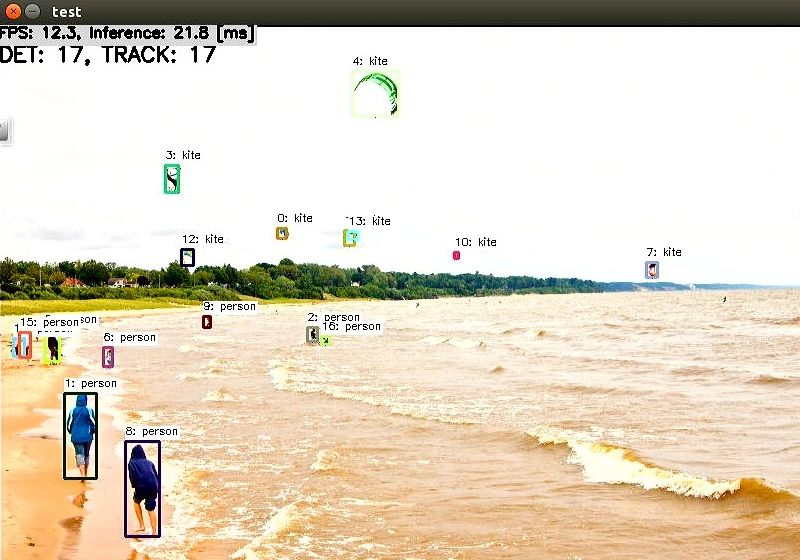

# CenterNet Object Detection with TensorRT in C++
Sample project to run CenterNet Object Detection

## Target Environment, How to Build, How to Run
1. Please follow the instruction: https://github.com/iwatake2222/play_with_tensorrt/blob/master/README.md
2. Additional steps:
    - Download the model using the following script
        - https://github.com/PINTO0309/PINTO_model_zoo/blob/main/042_centernet/01_float32/download.sh
        - copy `ctdet_coco_dlav0_384.onnx` to `resource/model/ctdet_coco_dlav0_384.onnx`
    - Place  `resource/kite.jpg` and `resource/model/label_coco_80.txt`
        - https://user-images.githubusercontent.com/11009876/128452081-4ea8e635-5085-4d9f-b95f-cb4fb7475900.jpg
        - https://github.com/iwatake2222/play_with_tflite/files/6938693/label_coco_80.txt
    - Build  `pj_tensorrt_det_centernet` project (this directory)

## Acknowledgements
- https://github.com/xingyizhou/CenterNet.git
- https://github.com/PINTO0309/PINTO_model_zoo
