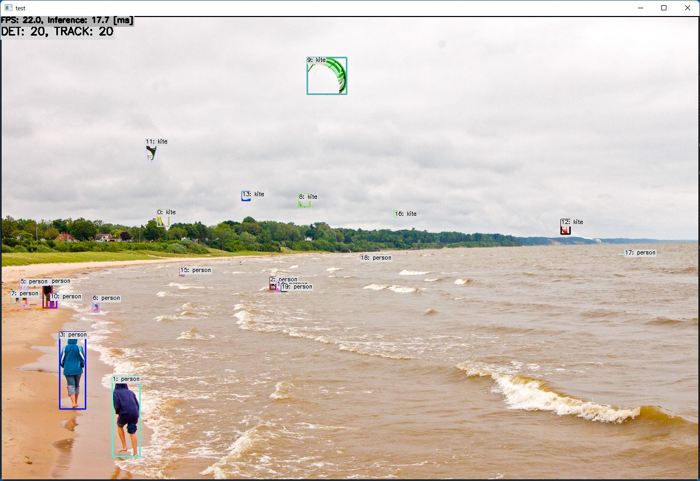

# YOLOv7 with TensorRT in C++
Sample project to run YOLOv7 + SORT

*yolov7_736x1280 with TensorRT on GeForce RTX 3060 Ti*

## How to Run
1. Please follow the instruction: https://github.com/iwatake2222/play_with_tensorrt/blob/master/README.md
2. Additional steps:
    - Download the model using the following script
        - https://github.com/PINTO0309/PINTO_model_zoo/blob/main/307_YOLOv7/download.sh
        - copy `yolov7_736x1280` to `resource/model/yolov7_736x1280`
        - copy `yolov7-tiny_384x640` to `resource/model/yolov7-tiny_384x640`
    - Build  `pj_tensorrt_det_yolov7` project (this directory)

- Note:
    - Execution at the first time may take time due to model conversion
    - If you want to try quickly, use ONNX Runtime (enable `INFERENCE_HELPER_ENABLE_ONNX_RUNTIME` when run cmake, and use `kOnnxRuntime` )

## Acknowledgements
- https://github.com/WongKinYiu/yolov7
- https://github.com/PINTO0309/PINTO_model_zoo
