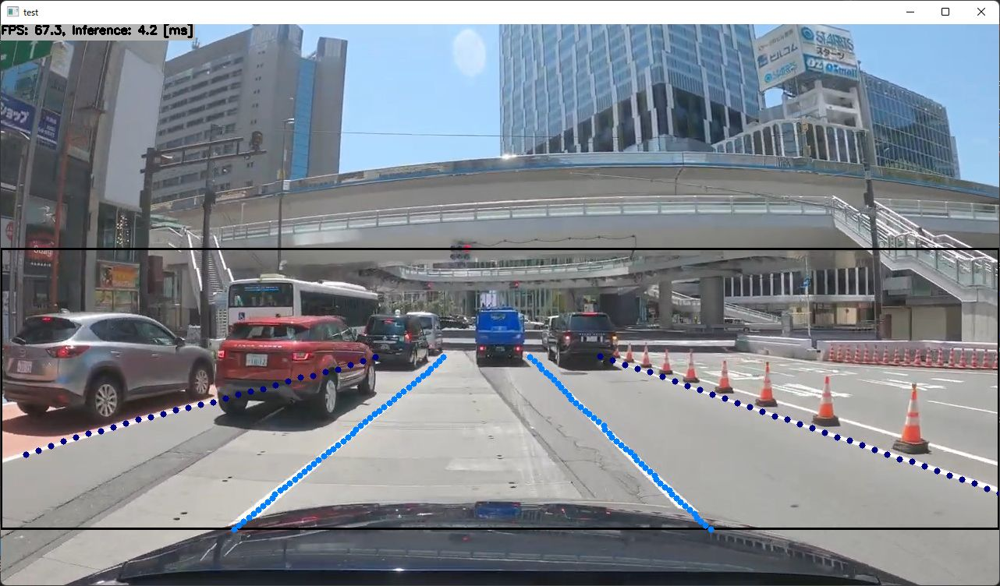

# Ultra-Fast-Lane-Detection-V2 with TensorRT in C++

## How to Run
1. Please follow the instruction: https://github.com/iwatake2222/play_with_tensorrt/blob/master/README.md
2. Additional steps:
    - Download the model using the following script
        - https://github.com/PINTO0309/PINTO_model_zoo/blob/main/324_Ultra-Fast-Lane-Detection-v2/download.sh
        - copy `ufldv2_culane_res18_320x1600.onnx` to `resource/model/ufldv2_culane_res18_320x1600.onnx`
    - Build  `pj_tensorrt_lane_ultra-fast-lane-detection_v2` project (this directory)

## Acknowledgements
- https://github.com/cfzd/Ultra-Fast-Lane-Detection-v2
- https://github.com/PINTO0309/PINTO_model_zoo
