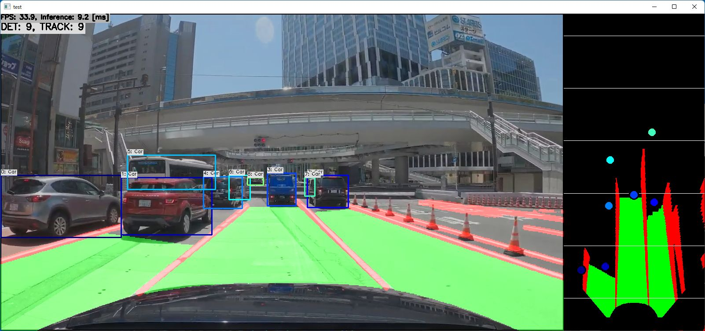

# YOLOPv2 with TensorRT in C++
Sample project to run YOLOPv2 + SORT + Bird's Eye View Transformation

https://user-images.githubusercontent.com/11009876/188130488-1f002976-4257-42f8-828a-cbf91c2d2eea.mp4

*yolopv2_736x1280 with TensorRT on GeForce RTX 3060 Ti*

[Link to full video on YouTube](https://www.youtube.com/watch?v=VRnNNkuk_UY)

## How to Run
1. Please follow the instruction: https://github.com/iwatake2222/play_with_tensorrt/blob/master/README.md
2. Additional steps:
    - Download the model using the following script
        - https://github.com/PINTO0309/PINTO_model_zoo/tree/main/326_YOLOPv2
        - copy `yolopv2_384x640` to `resource/model/yolopv2_384x640`
    - Build `pj_tensorrt_perception_yolopv2` project (this directory)

- Note:
    - Execution at the first time may take time due to model conversion
    - If you want to try quickly, use ONNX Runtime (enable `INFERENCE_HELPER_ENABLE_ONNX_RUNTIME` when run cmake, and use `kOnnxRuntime` )

## Acknowledgements
- https://github.com/CAIC-AD/YOLOPv2
- https://github.com/PINTO0309/PINTO_model_zoo
- Video
    - Drive Video by Dashcam Roadshow
    - 4K 東京→青森 718km 首都高-東北道全線-青森自動車道 冬季
    - https://www.youtube.com/watch?v=OjFrTDcVjy4
