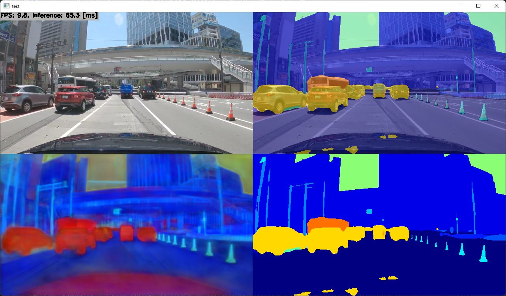
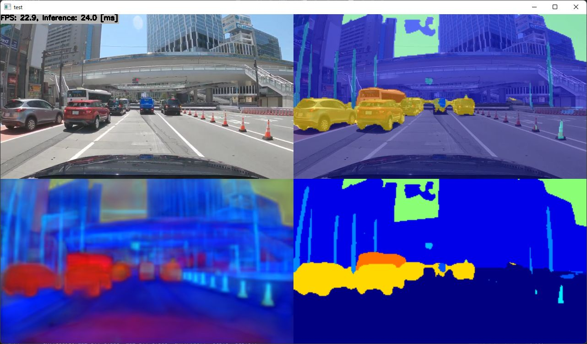

# Segmentation using PaddleSeg CityscapesSOTA with TensorRT in C++
Sample project for PaddleSeg CityscapesSOTA (The implementation of Hierarchical Multi-Scale Attention based on PaddlePaddle)

Sample video: https://youtu.be/xxx

↓↓↓ 360x640 ↓↓↓

↓↓↓ 180x320 ↓↓↓

## How to Run
1. Please follow the instruction: https://github.com/iwatake2222/play_with_tensorrt/blob/master/README.md
2. Additional steps:
    - Download the model using the following script
        - https://github.com/PINTO0309/PINTO_model_zoo/blob/main/201_CityscapesSOTA/download.sh
        - copy `saved_model_180x320/model_float32.onnx` to `resource/model/paddleseg_cityscapessota_180x320.onnx`
        - Note: make sure you use `saved_model_180x320/model_float32.onnx` not `saved_model_180x320/paddleseg_cityscapessota_180x320.onnx`
    - Build  `pj_tensorrt_seg_paddleseg_cityscapessota` project (this directory)

- Note:
    - Model conversion happens when you run the app for the first time, and it will takes time (It took about 40 minutes with RTX 3060 Ti)

## Acknowledgements
- https://github.com/PaddlePaddle/PaddleSeg/tree/release/2.3/contrib/CityscapesSOTA
- https://github.com/PINTO0309/PINTO_model_zoo
- Test image
    - Drive Video by Dashcam Roadshow
    - 4K東京ドライブ: 明治通りから国道1号 19km（池袋→新宿→渋谷→五反田）
    - https://www.youtube.com/watch?v=tTuUjnISt9s
    - around 15:06

